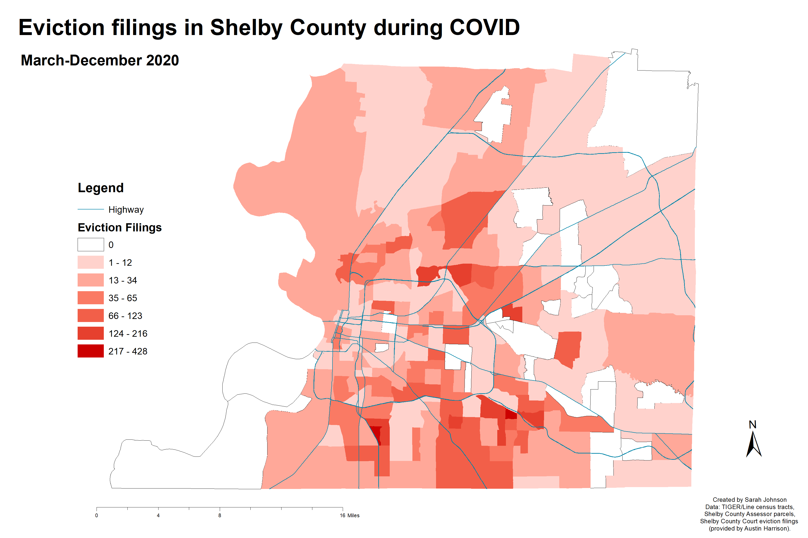

```{r setup, include=FALSE}
knitr::opts_chunk$set(
  echo = TRUE,
  warning = FALSE,
  message = FALSE,
  R.options = list(width = 60)
  )
```

Mapping data is one of the most important skills I learned in grad school for urban planning. This post will be simple but technical.

# ArcMap vs. R

In school we used ArcMap, and typically our workflow was to download map boundaries from the [US Census Bureau's TIGER/Line](https://www.census.gov/geographies/mapping-files/time-series/geo/tiger-line-file.html) database, download corresponding [Census](https://data.census.gov/cedsci/) data, join the two, and adjust sliders and colors until the map looked good.

The final maps could look pretty nice. Below is a map I made for a class this past spring semester mapping the number of eviction filings in each Census tract in Shelby County from March to December 2020.



ArcGIS is a very useful software, but I plan to use R for posts on this site. Why?

For one, I lost access to ESRI software once I graduated, while R/RStudio is free and open source. The R programming language has been around for 28 years,[^1] meaning it's well established, and it has a large, dedicated community. It's constantly improving and gaining features. I did not use R for over a year and when I returned, the R Markdown editor and various mapping packages had greatly improved.

[^1]: It's older than me 😮

In this post I want to highlight two specific advantages R has when it comes to mapping:

1.  How easy it is to get boundaries
2.  Interactive maps.

This post is focused on boundaries; I don't plan to map any data just yet. I want to recreate the components of the above map: roads and census tracts.

# Getting boundaries with `tigris`

The `tigris` R package makes it easy to get and use Census TIGER/Line shapefiles.

First, load the package. If this is your first time using it, run `install.packages("tigris")`.

```{r}
library(tigris)
options(tigris_use_cache = TRUE)
```

Then, choose your boundaries.

``` {.R}
roads <- primary_secondary_roads("TN")
tracts <- tracts("TN", "Shelby")
```

```{r tigris, include=FALSE}
roads <- primary_secondary_roads("TN")
tracts <- tracts("TN", "Shelby")
```

We can quickly view the boundaries with `plot(YOUR_BOUNDARY_NAME$geometry)`.

```{r plot}
plot(roads$geometry)
plot(tracts$geometry)
```

I won't need roads for the entire state; only those in Shelby County. At this point in ArcMap I would clip the boundaries.

```{r}
library(sf)
shelby <- st_combine(tracts)
shRoads <- st_crop(roads, shelby)
plot(shRoads$geometry)
```

# Interactive maps with `mapview`

The `mapview` package allows us to turn our boundaries into interactive maps with multiple layers.

```{r mapview}
library(mapview)
mapview(list(tracts, shRoads))
```

# Review

Here's the summary.

Up next:

Another R pro: The ability to collect specific Census data and geographic data simultaneously without downloading anything.

Appendix: Changes in Boundaries Over Time

Yearly differences in TIGER/LINE files
