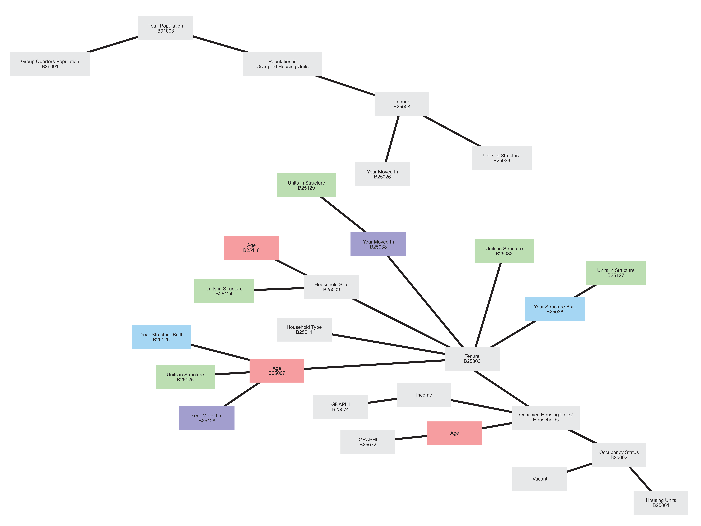
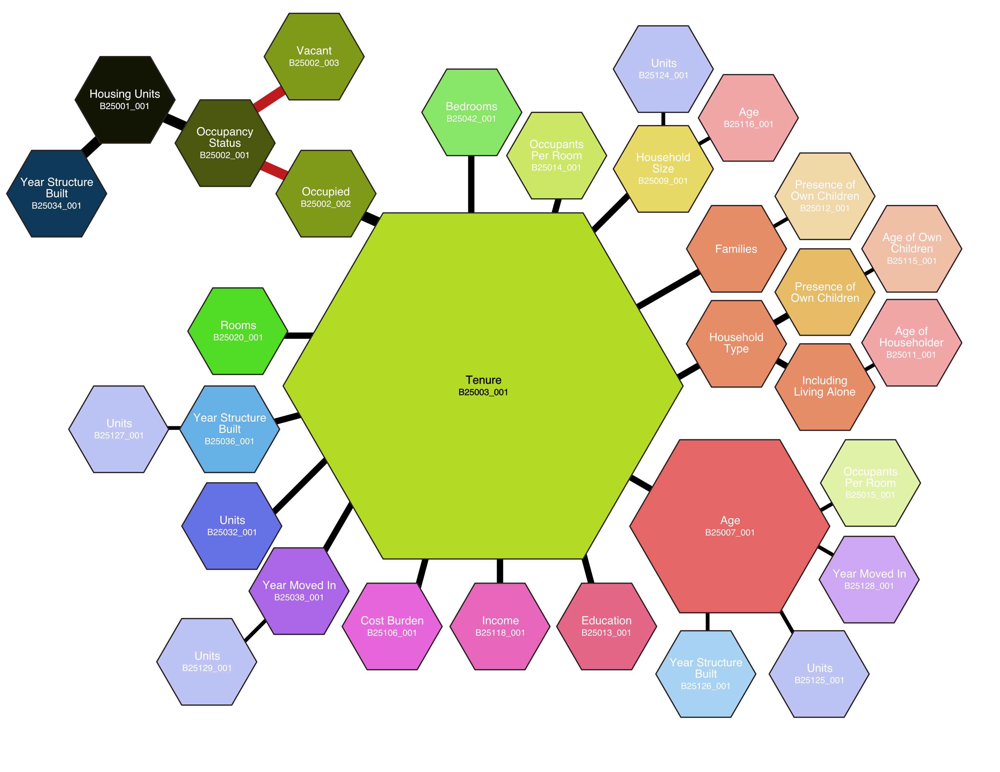

```{r setup, include=FALSE}
knitr::opts_chunk$set(echo = TRUE, message = FALSE, warning = FALSE)
```

Happy holidays! Though I didn't get a Christmas tree this year, I would like to share my Census tree 🎄. This post can be technical and it helps to have some prior knowledge of Census variables to understand what I'm creating. If you're feeling confused, I recommend viewing the two images below and skipping ahead to the [final output](sarahjohnson.io/reference/2021-12-24-census-tree/census-tree.html#tree).

## Background

The Census collects a lot of information. The Bureau uses variables to identify the information they distribute digitally (ex: **B01003**: Total Population). A list of all variables is available on the [Census API website](https://api.census.gov/data/2019/acs/acs5/variables.html). Variables often share/combine information. Related variables are usually numbered close together, but not always. Knowing which variable you're looking for can make research go faster, and ensures you're working with the right data.[^1] The **tidycensus** R package makes this information easily available so you can search and filter for the variables you need. In this post I use R and the Terminal to visualize Census variables.

[^1]: Watch out for similar datasets like **B25008**: "Total Population in Occupied Housing Units by Tenure" and **B25003**: "Households by Tenure".

### Manual mapping

For a long time I've been trying to find a way to visualize Census variables to better understand what information is available. First I tried manually mapping out the variables:





These drafts were helpful at getting started but were tedious to manually draw. I knew there was a better way digitally, but I wanted something more than a table. I looked into how to make diagrams using [DiagrammeR](http://rich-iannone.github.io/DiagrammeR/graphviz_and_mermaid.html), but I couldn't figure out the functions to turn the variables into a massive diagram.

### Homebrew & Tree

Outside of R, I've been getting more comfortable using the Terminal on my Mac. I've been using [Homebrew](https://brew.sh/) for a while to download apps and packages for my computer. There's only a few simple commands to learn, so it's helped make programming less intimidating. I like checking Homebrew's analytics page for the [most popular recent installs](https://formulae.brew.sh/analytics/cask-install/30d/). This is how I also learned about [tree](https://formulae.brew.sh/formula/tree), which displays directories (folders 📁) in a visual, nested format. I realized this could be used to visualize Census variables.

I used the command `mkdir` to create new folders from the Terminal and began sketching out my digital tree:

``` zsh
#' Attempt at manually building a Census tree.

Documents/census-old
├── B01003_population
│   ├── B26001_group-quarters-population
│   └── population-in-occupied-housing-units
│       └── B25008_tenure
│           ├── B25026_year-moved-in
│           └── B25033_units-in-structure
└── B25001_housing-units
    ├── B25003_occupancy-status
    │   ├── B25003_002_occupied
    │   │   ├── B25003_tenure
...
130 directories, 0 files

#' ex. B25008: Total Population in Occupied Housing Units by Tenure by Units in Structure
```

Copy and pasting variables was more efficient than my earlier drawings, but it was still taking too long, and manual entry was liable to mistakes. Still, I got a better idea of what I wanted: each variable ID next to its final variable, with the remainder of variables nested.

In my programming studies, I've learned computers are really good at going through text files. It's common to have a program run through a `.txt` file and apply the same function to each line. I knew I could use R to convert a `.csv` of Census variables into a `.txt` list of folders. I still didn't know how to turn a `.txt` list of folders into real folders, but thankfully searching online quickly returned exactly that I was looking for, from [this post by Senthil Kumar](https://ostechnix.com/create-directories-text-file-linux/).

## The Code

Without further ado, here's how I created a tree of Census variables, first using R to get the variables into the correct format and create a `.txt` file, and then using the Terminal to convert the `.txt` file into folders to form a tree.

### Part 1: R

First, I use R to get a list of Census variables, change the format of the list, and export the list to a `.txt` file.

#### Get variables

To get started, we'll need the **tidycensus** package to access the Census API's list of variables, and **tidyverse** to wrangle the data into the correct format.

```{r}
library(tidyverse)
library(tidycensus)
```

Use the **tidycensus** `load_variables()` function to get the variables from the dataset you need.

```{r}
v19 <- load_variables(2019, "acs5")
```

I also narrowed for housing-related variables, which start with "B25...".

```{r}
hsg <- v19 %>% 
  filter(str_detect(name, "^B25"))

head(hsg)
```

The tables above each have three columns:

-   `name`: the Census variable ID

-   `label`: the description of the variable ID/full, specific variables in the data

-   `concept`: the table the variable ID falls under/general variables in the data

For example, table **B25002** provides data on the occupancy status of housing units for a particular geography. **B25002_002** is the number of occupied units, **B25002_003** is the number of vacant units, and **B25002_001** is the summary variable for the table, the total number of housing units (totaling **B25002_002 + B25002_003**). **B25002_001** will be the same value as **B25001_001**.

We have the information we need to create our directory list.

#### Tidy

To prepare the data for our `.txt` file, we need to reorganize and clean the data into one column.

`filter()`: There are 2,207 variables related to housing, but I don't want a tree that is too long to digest (I can always make more trees). I narrowed my scope to only the top-level variables, ending with "\_001". I also omitted variables that are aggregates, medians, or the same concept broken down by race. These variables are useful but will not be the focus of this tree.

`mutate()`: Census data is pretty standardized, so there's not a lot of work to change the variables into what we need. Most of the mutating is related to cleaning up punctuation and spaces, since we don't really want those in a file name. I omitted the "B" at the start of every variable, so the variable ID number will appear at the top of folder lists.

Every time " BY " is mentioned in the `concept` column, it indicates a subvariable, which we need to turn into a subfolder `/`. Then append the `name` column to include the variable ID using `unite()`.

```{r}
h1 <- hsg %>% 
  filter(str_detect(name, "_001$"),           #' only top-level variables
         !str_detect(name, "[:alpha:]_"),     #' omit race variables
         str_detect(label, "Estimate!!Total") #' omit aggregates, medians, etc.
         ) %>% 
  select(-label) %>%
  mutate(concept = str_replace_all(concept, "-(?=[:alpha:])", " "),
         concept = str_remove_all(concept, "[:punct:]"),
         concept = str_replace_all(concept, " BY ", "/"),
         name = str_remove(name, "_001"),
         name = str_remove_all(name, "^B")
         ) %>% 
  unite(col = "fileStr", concept, name, sep = "/", na.rm = TRUE) %>% 
  mutate(fileStr = str_replace_all(fileStr, "\\s", "-"),
         fileStr = str_replace_all(fileStr, "-{2,}", "-"))

head(h1)
```

We're left with one column and 76 rows. Each row is a folder structure for the Census variable.

Now we're ready to turn our column of folder structures into real folders. I'm going to use more emojis so the code doesn't look intimidating.

#### Export

Turn the column into a list of values.

```{r}
vH1 <- h1$fileStr
```

Use `write_lines()` to convert the list into a `.txt` 📄.

```{r}
write_lines(vH1, file = "~/Documents/H1.txt")
```

The output is a `.txt` 📄 with 76 lines, each line containing the folder structure for the Census table. As written, it outputs to your Documents 📁.

### Part 2: Terminal

Now we'll use the Terminal to convert the `.txt` 📄 into real folders and create our tree.

Open the Terminal. Create a new 📁 to contain the tree using `mkdir`. Move into the the new 📁 by using `cd` (change directory).

``` zsh
mkdir ~/Documents/census
cd Documents/census
```

Below is the function that creates a new 📁 for every row in the `.txt` 📄.

``` zsh
xargs -I {} mkdir -p "{}" < "../H1.txt"
```

Your folder should now be completed.

#### Census Tree 🎄 {#tree}

Enter `tree` to see the finished product (requires [tree](https://formulae.brew.sh/formula/tree)). Below is a list of all Census tables that start with "B25", omitting aggregates, medians, and race subvariables.

``` zsh
tree
.
├── AGE-OF-HOUSEHOLDER
│   ├── GROSS-RENT-AS-A-PERCENTAGE-OF-HOUSEHOLD-INCOME-IN-THE-PAST-12-MONTHS
│   │   └── 25072
│   ├── MEALS-INCLUDED-IN-RENT
│   │   └── 25055
│   └── SELECTED-MONTHLY-OWNER-COSTS-AS-A-PERCENTAGE-OF-HOUSEHOLD-INCOME-IN-THE-PAST-12-MONTHS
│       └── 25093
├── BEDROOMS
│   ├── 25041
│   └── GROSS-RENT
│       └── 25068
├── CONTRACT-RENT
│   └── 25056
├── GROSS-RENT
│   └── 25063
├── GROSS-RENT-AS-A-PERCENTAGE-OF-HOUSEHOLD-INCOME-IN-THE-PAST-12-MONTHS
│   └── 25070
├── HOUSE-HEATING-FUEL
│   └── 25040
├── HOUSEHOLD-INCOME
│   ├── GROSS-RENT-AS-A-PERCENTAGE-OF-HOUSEHOLD-INCOME-IN-THE-PAST-12-MONTHS
│   │   └── 25074
│   └── SELECTED-MONTHLY-OWNER-COSTS-AS-A-PERCENTAGE-OF-HOUSEHOLD-INCOME-IN-THE-PAST-12-MONTHS
│       └── 25095
├── HOUSEHOLD-INCOME-IN-THE-PAST-12-MONTHS-IN-2019-INFLATION-ADJUSTED-DOLLARS
│   ├── GROSS-RENT
│   │   └── 25122
│   └── VALUE
│       └── 25121
├── HOUSING-UNITS
│   └── 25001
├── INCLUSION-OF-UTILITIES-IN-RENT
│   └── 25069
├── KITCHEN-FACILITIES
│   └── MEALS-INCLUDED-IN-RENT
│       └── 25054
├── KITCHEN-FACILITIES-FOR-ALL-HOUSING-UNITS
│   └── 25051
├── KITCHEN-FACILITIES-FOR-OCCUPIED-HOUSING-UNITS
│   └── 25052
├── MONTHLY-HOUSING-COSTS
│   └── 25104
├── MORTGAGE-STATUS
│   ├── 25081
│   ├── AGE-OF-HOUSEHOLDER
│   │   └── 25027
│   ├── HOUSEHOLD-INCOME-IN-THE-PAST-12-MONTHS-IN-2019-INFLATION-ADJUSTED-DOLLARS
│   │   └── 25098
│   ├── MONTHLY-HOUSING-COSTS-AS-A-PERCENTAGE-OF-HOUSEHOLD-INCOME-IN-THE-PAST-12-MONTHS
│   │   └── 25101
│   ├── RATIO-OF-VALUE-TO-HOUSEHOLD-INCOME-IN-THE-PAST-12-MONTHS
│   │   └── 25100
│   ├── REAL-ESTATE-TAXES-PAID
│   │   └── 25102
│   ├── SELECTED-MONTHLY-OWNER-COSTS-AS-A-PERCENTAGE-OF-HOUSEHOLD-INCOME-IN-THE-PAST-12-MONTHS
│   │   └── 25091
│   └── VALUE
│       └── 25096
├── MORTGAGE-STATUS-AND-SELECTED-MONTHLY-OWNER-COSTS
│   └── 25087
├── OCCUPANCY-STATUS
│   └── 25002
├── PLUMBING-FACILITIES
│   └── OCCUPANTS-PER-ROOM
│       └── YEAR-STRUCTURE-BUILT
│           └── 25050
├── PLUMBING-FACILITIES-FOR-ALL-HOUSING-UNITS
│   └── 25047
├── PLUMBING-FACILITIES-FOR-OCCUPIED-HOUSING-UNITS
│   └── 25048
├── PRICE-ASKED
│   └── 25085
├── RACE-OF-HOUSEHOLDER
│   └── 25006
├── RENT-ASKED
│   └── 25061
├── ROOMS
│   └── 25017
├── SELECTED-MONTHLY-OWNER-COSTS
│   └── 25094
├── TENURE
│   ├── 25003
│   ├── AGE-OF-HOUSEHOLDER
│   │   ├── 25007
│   │   ├── OCCUPANTS-PER-ROOM
│   │   │   └── 25015
│   │   ├── UNITS-IN-STRUCTURE
│   │   │   └── 25125
│   │   ├── YEAR-HOUSEHOLDER-MOVED-INTO-UNIT
│   │   │   └── 25128
│   │   └── YEAR-STRUCTURE-BUILT
│   │       └── 25126
│   ├── BEDROOMS
│   │   └── 25042
│   ├── EDUCATIONAL-ATTAINMENT-OF-HOUSEHOLDER
│   │   └── 25013
│   ├── FAMILIES-AND-PRESENCE-OF-OWN-CHILDREN
│   │   └── 25012
│   ├── HOUSE-HEATING-FUEL
│   │   └── 25117
│   ├── HOUSEHOLD-INCOME-IN-THE-PAST-12-MONTHS-IN-2019-INFLATION-ADJUSTED-DOLLARS
│   │   └── 25118
│   ├── HOUSEHOLD-SIZE
│   │   ├── 25009
│   │   ├── AGE-OF-HOUSEHOLDER
│   │   │   └── 25116
│   │   └── UNITS-IN-STRUCTURE
│   │       └── 25124
│   ├── HOUSEHOLD-TYPE-AND-PRESENCE-AND-AGE-OF-OWN-CHILDREN
│   │   └── 25115
│   ├── HOUSEHOLD-TYPE-INCLUDING-LIVING-ALONE-AND-AGE-OF-HOUSEHOLDER
│   │   └── 25011
│   ├── HOUSING-COSTS-AS-A-PERCENTAGE-OF-HOUSEHOLD-INCOME-IN-THE-PAST-12-MONTHS
│   │   └── 25106
│   ├── KITCHEN-FACILITIES
│   │   └── 25053
│   ├── OCCUPANTS-PER-ROOM
│   │   └── 25014
│   ├── PLUMBING-FACILITIES
│   │   ├── 25049
│   │   └── OCCUPANTS-PER-ROOM
│   │       └── 25016
│   ├── ROOMS
│   │   └── 25020
│   ├── SELECTED-PHYSICAL-AND-FINANCIAL-CONDITIONS
│   │   └── 25123
│   ├── TELEPHONE-SERVICE-AVAILABLE
│   │   └── AGE-OF-HOUSEHOLDER
│   │       └── 25043
│   ├── UNITS-IN-STRUCTURE
│   │   └── 25032
│   ├── VEHICLES-AVAILABLE
│   │   ├── 25044
│   │   └── AGE-OF-HOUSEHOLDER
│   │       └── 25045
│   ├── YEAR-HOUSEHOLDER-MOVED-INTO-UNIT
│   │   ├── 25038
│   │   └── UNITS-IN-STRUCTURE
│   │       └── 25129
│   └── YEAR-STRUCTURE-BUILT
│       ├── 25036
│       └── UNITS-IN-STRUCTURE
│           └── 25127
├── TOTAL-POPULATION-IN-OCCUPIED-HOUSING-UNITS
│   └── TENURE
│       ├── 25008
│       ├── UNITS-IN-STRUCTURE
│       │   └── 25033
│       └── YEAR-HOUSEHOLDER-MOVED-INTO-UNIT
│           └── 25026
├── UNITS-IN-STRUCTURE
│   └── 25024
├── VACANCY-STATUS
│   └── 25004
├── VACANT-CURRENT-RESIDENCE-ELSEWHERE
│   └── 25005
├── VALUE
│   └── 25075
└── YEAR-STRUCTURE-BUILT
    └── 25034
    
160 directories, 0 files
```

So, if you're looking for data on "Total Population in Occupied Housing Units by Tenure", use table B25008. To find "Total Population in Occupied Housing Units by Tenure by Units in Structure", use table B25033.

The `find` command can be used in Terminal to search the current directory (`.`) for a word, with an asterisk `*` as a wildcard.

``` zsh
find . -name "AGE*"
./AGE-OF-HOUSEHOLDER
./TENURE/AGE-OF-HOUSEHOLDER
./TENURE/VEHICLES-AVAILABLE/AGE-OF-HOUSEHOLDER
./TENURE/TELEPHONE-SERVICE-AVAILABLE/AGE-OF-HOUSEHOLDER
./TENURE/HOUSEHOLD-SIZE/AGE-OF-HOUSEHOLDER
./MORTGAGE-STATUS/AGE-OF-HOUSEHOLDER
```

Once the folder structure is made, you have a handy Census variable reference on your computer. Just `cd` into the folder and enter `tree` to see it all again. You can use these variables with the **tidycensus** package, or on [data.census.gov](https://data.census.gov/cedsci/).

The R code [above](https://sarahjohnson.io/reference/2021-12-24-census-tree/census-tree.html#r-code) can also be changed to return a different combination of variables and create a different folder structure.

Happy holidays ⛄🎄🔔
